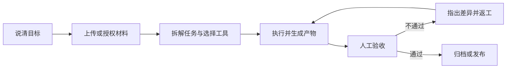

# 第 1 章 初识千问办公

**千问办公（QwenWork）** 是阿里巴巴推出的一站式 AI Agent 办公平台，

面向 HR、法务、财务、运营、博主、商家、教师、分析师等不同角色，把"交代一句话"变成"交付一套可用的工作成果"。

## 从"回答问题"到"交付结果"

与传统 AI 对话不同，千问办公不只是陪用户聊天、回答问题或者给出建议。

用户只需要用一句自然语言说明目标，它就可以自主规划步骤、调用已授权的工具、处理文件，并交付文档、表格、PPT、PDF、图片、音视频、网页、代码或分析报告。

一个完整任务通常包含五个要素：

| 要素 | 说明 |
|-|-|
| 任务目标 | 要完成什么，成功标准是什么 |
| 输入材料 | 文件、参考资料和可用账号 |
| 计划与工具 | Agent 的拆解步骤、工具调用和授权请求 |
| 交付结果 | 可查看、下载、继续编辑的产物 |
| 人工验收 | 检查结果，必要时返工 |

例如，你可以直接告诉千问办公：分析这份销售表，找出下滑最多的三个品类，生成一份给负责人看的汇报 PPT。

它会读取表格、完成分析、生成图表，并输出一份可以在 Office 里继续编辑的 PPTX 文件——而不是给你一段"建议你这样做"的文字。

千问办公面向的是完整的工作任务。

它的核心能力可以概括为三点：**听得懂目标，能够自主规划执行，也真的能把产物交付到你手里。**

## 六大核心能力

千问办公官网把产品能力概括为六项，这也是本蓝皮书第二篇案例的组织线索：

| 能力 | 做什么 | 典型场景 |
|-|-|-|
| 企业协作 | 打通企业 IM：消息群聊、考勤审批、会议日程、文档表格、知识库与邮件等 25 项能力 | 汇总群消息写周报、建日程、发起审批材料 |
| 产物交付 | 输出 PPTX、Word、Excel、HTML 等产物，原生支持 Office 套件预览与实时编辑 | 汇报 PPT、台账 Excel、方案 Word |
| 多模态 | 理解图片、音频、视频，并集成 AI 生成模型完成图文音视频创作 | 素材提炼、封面图、口播音频 |
| 网页交付 | 制作带数据库与交互逻辑的免部署独立网页，全流程在线发布 | 产品页、表单、数据看板 |
| 数据聚合 | 接入 1688 等电商后台、小红书等社交媒体，跨来源聚合数据 | 选品分析、经营日报 |
| 技能市场 | 自定义创建、上传和分享技能，公开市场汇聚专家套件 | 行业研究、内容增长、经营分析套件 |

除了六大能力，千问办公还提供任务编排能力：复杂任务自动拆解、多线并行推进、进度可跟踪。这是它区别于"一次一问一答"工具的关键。

## 三个使用入口

千问办公目前有三种正式入口，功能并不完全相同：

| 入口 | 进入方式 | 更适合什么 |
|-|-|-|
| 钉钉 PC 端 | 钉钉左侧栏中的"千问办公" | 日常办公、团队协作和钉钉内容处理 |
| 网页端 | 浏览器访问 qwenwork.cn | 快速发起任务、处理在线资料和生成内容 |
| PC 客户端 | 从 qwenwork.cn 下载（macOS 14+ / Windows 10+） | 高频复杂任务、本地文件与浏览器自动化 |

注意两点：

- **多端覆盖不等于每端功能相同**。浏览器自动化和本地文件操作以桌面客户端实际入口为准；目前没有独立移动客户端。
- **能力入口与授权是两回事**。页面展示某项能力，不代表它可以读取所有文件或企业数据；本地文件、浏览器、钉钉数据都受当前账号和显式授权限制。

## 使用边界：先记住三条

1. 涉及发送消息、提交表单、修改第三方系统等外部动作时，先确认授权范围。
2. 财务、法律、医疗和重要经营决策必须由具备责任与资质的人复核。
3. 不要上传无权处理的个人信息、商业秘密或受限制数据。

下一章，我们把入口、登录和套餐积分一次讲清楚。
