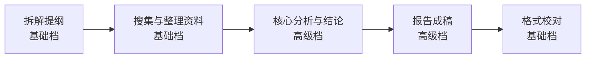

# 第 5 章 模型选择与积分用量优化

千问办公会持续更新、替换或下线模型。选择时先看任务复杂度，再考虑质量、速度和积分；长期流程应记录"需要哪一档能力"，不要只绑定一个可能变化的模型名称。

## 三档模型怎么选

在任务输入区打开模型选择器，当前版本通常列出基础、高级和预览档（如 Qwen3.8-Max-Preview）。

| 档位 | 适合 | 不适合 |
|-|-|-|
| 基础 | 文件整理、格式转换、初稿、简单问答、批量轻任务 | 复杂分析、对外正式交付 |
| 高级 | 汇报 PPT、经营分析、行业调研、长文档 | 纯格式转换这类简单活 |
| 预览 | 尝鲜更强能力，容忍偶发不稳定 | 要求稳定的生产流程 |

一个容易忽略的事实：**任务失败的一半原因不是模型不够强，而是任务描述没说清**。在升级模型之前，先回头检查五问是否写全。

## 积分消耗的心智模型

积分消耗大致和这些因素正相关：

- 模型档位：高级档比基础档贵。
- 输入材料量：塞进去的文件越多越贵。
- 执行步数：任务拆得越细、工具调用越多，消耗越大。
- 返工次数：每次"再来一版"都在重新付费。

对应的四个省积分习惯：

1. **分阶段切档**：拆解和草稿用基础档，定稿步骤切高级档。
2. **材料最小化**：只上传当前任务需要的文件；大文件先让 AI 抽取摘要再分析。
3. **一次说清**：把格式、结构、验收标准一次写全，减少来回。
4. **差异返工**：修改时说清改哪里，不推倒重来。

## 同一任务内的阶段切换

复杂任务可以在过程中切换模型。以"行业调研报告"为例：

只有 C、D 两步真正决定报告质量，把高级档的预算花在那里。

## 用量监控

- 积分余额、赠送积分有效期以账户页当前展示为准；每日登录赠送当日有效，别忘了领。
- 免费版的并行任务上限是 10 个，超出会排队；标准版及以上无上限。
- 积分用尽时可购买积分包（标准版及以上），或等待下月基础积分与每日赠送。

## 一个反直觉的建议

不要把"用最贵的模型"当成默认选项。**先用基础档把任务跑通一遍**，你会清楚地看到哪一步质量不够——然后把那一步单独升级。这比全程高级档既省钱，效果也更可控。

下一章进入千问办公最有特色的能力：专家套件与技能市场。
