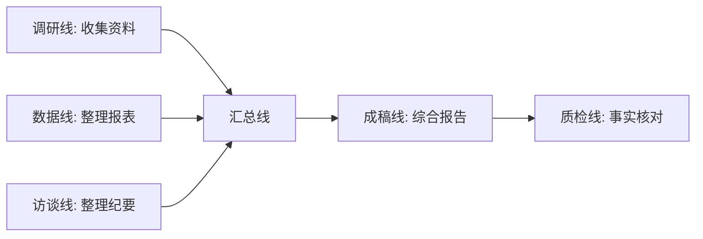

# 第 21 章 多任务编排：并行推进与进度管理

千问办公的任务编排能力包括：复杂任务自动拆解、多线并行推进、进度可跟踪。这一章讲怎么用，以及什么时候不该用。

## 并行的价值与代价

| 价值 | 代价 |
|-|-|
| 多个独立子任务同时进行，总时长缩短 | 积分消耗叠加 |
| 调研、生成、校验分线推进 | 各线结果可能口径不一致 |
| 等待人工确认时其他线继续跑 | 并行越多，验收工作量越大 |

**原则：有依赖关系的步骤串行，无依赖的步骤并行。**

## 什么时候适合并行

- 调研类：多个信息源可以同时检索。
- 生成类：多平台内容可以各自起草。
- 校验类：生成和质检分两条线互相挑错。
- 批量类：多个文件的同类处理。

什么时候不适合：需要前一步结论才能开始下一步的任务；人工确认点密集的任务；预算紧张时的探索性任务。

## 编排的三种姿势

### 姿势一：一次任务内的自动拆解

复杂任务交给千问办公时，明确要求拆解：

```text
任务：为新品上市准备全套材料（发布会 PPT、媒体通稿、FAQ、渠道话术）。
请先输出任务拆解和执行计划：
1. 列出子任务、依赖关系和先后顺序；
2. 标出哪些可以并行；
3. 每个子任务给出验收标准；
4. 计划经我确认后再开始执行。
```

### 姿势二：多任务并行管理

支持多智能体模式的端，可以在输入区切换模式，让多个任务并行推进。管理建议：

- 给每个并行任务一个明确的交付物名称（"PPT-v1""通稿-v1"），方便识别。
- 并行任务之间共享的事实材料，放在网盘统一位置，避免各线用不同版本。
- 免费版并行上限 10 个，排期时心里有数。

### 姿势三：流水线式接力



汇合点是最容易出错的地方：各线的术语、口径、时间范围要在任务开始时就统一约定。

## 进度跟踪的习惯

- 长任务开始前，先要一份执行计划；计划本身就是验收基线。
- 执行中关注两类信号：AI 主动提出的确认请求（必须回应）；反复出现的同类错误（说明任务描述有歧义）。
- 任务结束后，让千问办公输出执行总结：做了什么、用了什么材料、哪些步骤跳过或失败。

## 避坑清单

- 并行不等于撒手不管，汇合点必须人工验收。
- 各并行线用同一份"事实基线"材料，版本写进文件名。
- 积分有限时，先串行跑通再谈并行优化。
- 自动拆解的计划要看一眼再放行——AI 偶尔会拆出多余的步骤。
