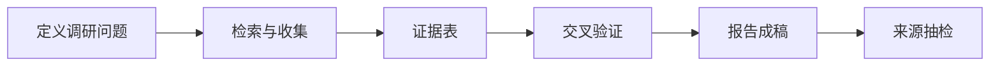

# 第 12 章 信息调研：从搜索到行业报告

千问办公可以检索网页、新闻、图片和内容平台，把分散的信息整理成结构化报告。这一章演示如何把"帮我调研一下"变成一个可控的调研流程。

## 官方界面中的人工确认


*截图来源：千问办公官方帮助中心“千问办公简介”，抓取于 2026 年 8 月 13 日。*

复杂调研并不一定从一句指令直接跑到成稿。官方截图展示了任务执行中的确认步骤：系统询问报告希望以 Word、PDF、Markdown 还是其他格式输出，并允许用户回答、跳过或进入下一题；右侧任务监控区用于查看待办、产物以及技能与 MCP。出现这类确认时，应当根据真实交付需求作答，不要让系统替你猜测。

## 调研任务的三个死法

1. **范围失控**：什么都能写，等于什么都没说清。
2. **来源失控**：引用了过时、同名或不可靠的来源。
3. **结论失控**：把搜索结果里的观点当成了事实。

对应的解法是在任务描述里固定三样东西：**调研问题清单、来源白名单、证据与观点分离**。

## 完整流程



### 第一步：把模糊需求变成问题清单

```text
我要调研【宠物智能用品市场】，请先不要开始搜索，
帮我把调研拆成 6-8 个具体问题，例如：
市场规模与增速、主要玩家、价格带、渠道结构、用户痛点、政策与标准。
输出问题清单，我确认后再开始检索。
```

### 第二步：检索并建立证据表

```text
按确认的问题清单开始检索：
1. 优先来源：官方统计、上市公司财报、权威媒体、行业协会报告；
   营销软文和无法溯源的内容不作为依据；
2. 每条关键信息记入证据表：问题、信息点、来源链接、发布日期、可信度评级；
3. 同一问题找到互相矛盾的信息时，并列呈现并标注分歧，不要自行取舍；
4. 信息尽量取最近 12 个月内的，更早的必须标注年份。
先输出证据表，我检查后再写报告。
```

### 第三步：成稿

```text
基于证据表撰写行业调研报告（Word）：
结构：摘要、市场概况、竞争格局、渠道与价格、用户洞察、风险与政策、附录证据表。
要求：
1. 每个关键数据标注来源编号，与附录证据表对应；
2. 没有证据支撑的判断统一放入"观点与假设"小节；
3. 摘要不超过一页，先给结论。
```

## 技能市场的助力

技能市场中的**行业研究 RESEARCH KIT** 就是为这类任务准备的专家套件，内置调研方法、证据标准和输出模板。安装后用 `/` 快捷命令调用，适合把调研做成常规工作的团队。

## 进阶：竞品调研的固定动作

```text
对【竞品 A、B、C】做对比调研：
维度：定价、核心功能、最近更新、用户评价中的高频抱怨。
输出：可追溯的对比表 + 每个结论的来源链接。
注意：只使用公开信息；用户评价要说明样本来自哪个平台、大概多少条。
```

## 避坑清单

- 证据表先于报告。没有证据表的调研报告，返工率极高。
- 来源抽检：随机点开 3 个引用链接，确认内容与引用一致。
- 警惕"据说""业内人士表示"这类无主体来源。
- 数据要带时间戳：2024 年的市场规模数据在 2026 年只能当背景。
- 调研产物归档时，把证据表和报告一起存进网盘。
