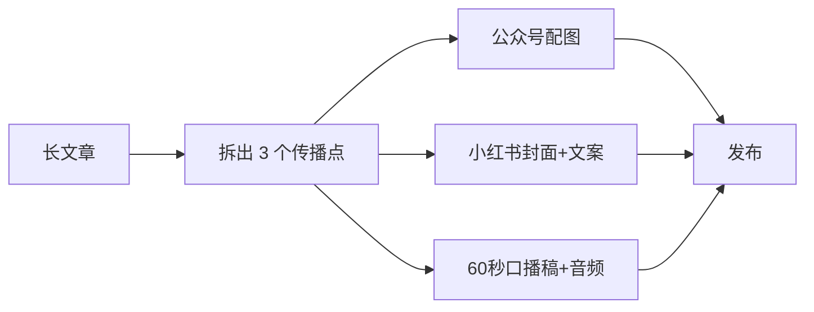

# 第 14 章 多模态创作：图文音视频一站式

千问办公能够理解图片、音频、视频等多模态内容，并集成顶级 AI 生成模型，完成素材分析、内容提炼与图文音视频创作。这一章把"理解"和"生成"两侧分开讲。

## 多模态理解：让 AI 先看懂材料

| 输入 | 能做什么 |
|-|-|
| 图片 | 识别内容、提取文字、分析版式、对比设计稿 |
| 音频 | 转写、提炼要点（配合会议场景见第 15 章） |
| 视频 | 内容摘要、关键帧提取、素材盘点 |

示例：

```text
附件是竞品的 6 张海报图。请分析：
1. 每张的主标题、副标题和卖点；
2. 配色、版式和视觉风格的共性；
3. 总结成一份 300 字的风格简报，供我们设计参考。
```

## 多模态生成：从文案到素材

### 封面与配图

```text
为公众号文章《制造业如何用 AI 做质检》生成封面图：
风格：科技感、深蓝主色、简洁构图；
元素：流水线 + 放大镜/扫描光效；
尺寸：900×383；
文字：主标题"AI 质检上线记"，字体醒目。
先给 2 个方案草图，我选定后出成品。
```

### 口播与音频

```text
把这份 800 字的产品介绍改写成 60 秒口播稿：
口语化、有停顿标记，结尾带行动号召；
确认后生成配音音频，语气自然、语速适中。
```

### 视频素材

```text
我有一段 3 分钟的产品演示视频，请：
1. 转写成文字并分段落；
2. 剪出 3 个 15 秒的亮点片段建议（标出起止时间）；
3. 为每个片段写一句适合短视频平台的标题。
```

视频的实际剪辑能力以当前端和模型为准；复杂的精细剪辑建议把 AI 的粗剪结果导入专业工具完成。

## 设计工作台

创作类任务建议切换到**设计工作台**：界面提示和产出倾向更贴合视觉工作。幻灯片类任务用幻灯片工作台，长文案用写作工作台。

## 一条完整的内容生产线



一次任务描述可以同时要求多种产物，但建议**先出文案再生图**：文案定了，视觉才有依据。

## 避坑清单

- AI 生成的人物形象、字体、音乐用于商业用途前，确认版权和授权范围。
- 生成内容涉及真实品牌 logo、名人形象时不要直接使用，有侵权风险。
- 配图里的文字经常出错，发布前逐字检查。
- 音频转写要抽查关键段落（人名、数字、专业术语）。
- 多模态任务积分消耗较高，先用基础档试方向，定稿再用高级档。
