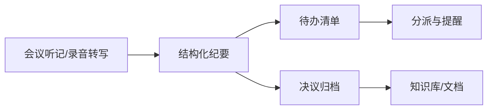

# 第 15 章 会议生产力：从 AI 听记到纪要与待办

会议结束不是工作的终点，纪要、待办和跟进才是。千问办公在钉钉链路里可以整理 AI 听记、安排日程会议、创建文档和待办，正好把"会后"这一段接住。

## 会后流水线



## 第一步：听记变纪要

```text
这是今天下午评审会的听记转写。请整理成会议纪要（Word）：
结构：会议主题与时间、参会人、讨论要点、决议事项、待办事项、遗留问题。
要求：
1. 决议必须写明"谁、做什么、何时完成"，三要素缺一就标"待确认"；
2. 讨论中的分歧如实保留，不要抹平成一致意见；
3. 口语废话全部去掉，但关键原话（如客户承诺、预算数字）保留原表述；
4. 不确定的发言人标"（发言人待确认）"，不要猜。
```

## 第二步：待办落到钉钉

```text
从纪要中提取待办事项，逐条创建钉钉待办：
1. 每条包含负责人、截止时间、来源（哪次会议哪个议题）；
2. 负责人不是我本人的待办，先列出来等我确认，不要直接指派；
3. 没有明确截止时间的，统一标为本周五，并在描述里注明"时间待确认"。
```

## 第三步：归档与下次会议

```text
1. 把纪要存入项目知识库的"会议纪要/2026-08"目录；
2. 根据遗留问题，在下周找一个 30 分钟空档创建跟进会，
   邀请今天提出遗留问题的同事；
3. 议程就写遗留问题清单。
```

## 会前也能用

千问办公同样适合会前准备：

```text
明天 10 点我要主持季度评审会，请帮我准备：
1. 从项目文档中汇总本季度关键数据，做成一页速览；
2. 列出上次会议遗留问题的当前状态；
3. 生成议程，并创建日程邀请相关人。
```

## 避坑清单

- 听记转写的人名和专业术语要人工校对，错误会传染到纪要。
- 涉及客户承诺、金额、交付时间的表述，回听原始录音确认。
- 纪要发送前让主持人过目——纪要代表的是会议的正式结论。
- 跨部门会议的纪要注意信息范围，别把 A 部门的讨论转发给无关群。
