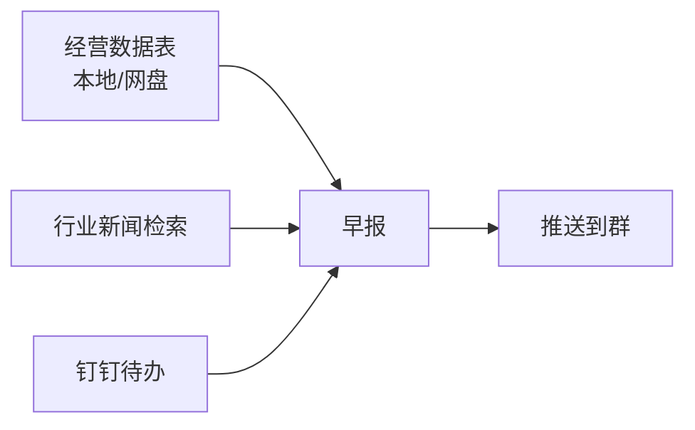

# 第 16 章 日常自动化：早报与资讯简报

定时任务最经典的落地场景就是"每天早上自动出现的报告"。这一章把第 9 章的机制变成一个真正在跑的系统：早报 + 资讯简报 + 异常兜底。

## 场景

团队每天 9:30 晨会。你希望 8:30 时，一份包含经营数据、行业资讯和待办提醒的早报已经出现在群里，而不是你每天 8 点爬起来手动拼。

## 设计：三个数据源，一份早报



## 第一步：先手动跑通一次

自动化之前，必须先手动成功一次。任务描述：

```text
请生成今天的晨会早报：
1. 经营速览：读取网盘中的 sales-daily.xlsx，输出昨日销售额、
   环比变化、top3 增长/下滑品类；
2. 行业资讯：搜索最近 24 小时【行业关键词】的重要新闻，
   筛选 3-5 条，每条一句话摘要 + 链接；
3. 今日待办：读取我的钉钉待办中今天到期的事项；
4. 排版：输出为一页 Markdown，结构固定为
   【昨日数据】【今日关注】【行业资讯】【今日待办】。
```

跑通后人工检查一遍：数字对不对、新闻相关吗、结构清晰吗。

## 第二步：变成定时任务

```text
把上面的早报任务设置为定时任务：
- 频率：工作日每天 08:30；
- 输入：sales-daily.xlsx 以网盘中最新版为准；
- 推送：完成后发送到钉钉群【晨会群】的 IM 频道；
- 失败处理：任何数据源失败时，早报中注明"XX 部分今日缺失"，
  其余部分照常发送；全部失败则发送一条简短的故障提示。
绝不允许编造数据填充。
```

## 第三步：加上质量护栏

自动跑了一周后，做一次复盘：

| 检查项 | 怎么查 | 处理 |
|-|-|-|
| 数字准确性 | 抽查 3 天数据回源 | 错一次就修提示词 |
| 新闻相关性 | 看有没有跑题新闻 | 收紧关键词，加排除词 |
| 送达稳定性 | 看执行记录有无失败 | 失败原因归类处理 |
| 阅读价值 | 问一句同事"有用吗" | 没用的板块直接砍掉 |

## 更多可以自动化的日常

- 竞品动态监测（有更新才推送，无更新不打扰）。
- 每周项目进度汇总（从文档和待办聚合）。
- 考勤异常提醒（结合钉钉考勤数据，注意隐私边界）。
- 数据日报网页化（结合第 13 章的持续更新网页）。

## 避坑清单

- 没有手动成功过的任务不要直接自动化。
- 失败策略比成功策略更重要：宁缺毋假。
- 早报篇幅要克制，一屏能看完才有打开率。
- 数据源格式变化（表头改了、文件改名了）是自动任务最常见的死因，提示词里写明"格式异常时报告而不是猜测"。
